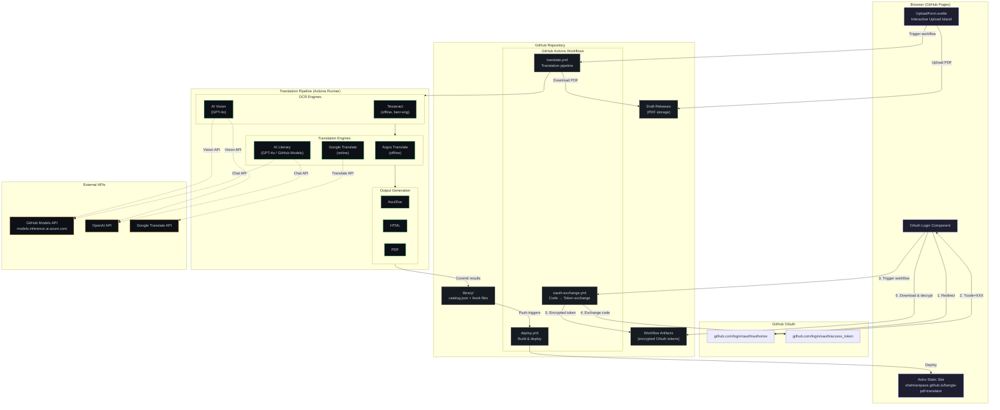

# Bangla PDF Translator

A library website that hosts Bangla books translated to English. Upload a Bangla PDF through the web UI, and GitHub Actions automatically processes it: OCR extraction, machine translation, and document generation. Results are committed to the repo and deployed to GitHub Pages.

Supports two OCR engines (Tesseract offline, AI vision models) and multiple translation backends (Argos offline, Google online, AI literary translation), with optional LLM refinement for literary-quality output.

## Architecture Diagram



## Activity Diagram — Upload & Translation Flow

```mermaid
flowchart TD
    Start([User visits Upload page]) --> AuthCheck{Authenticated?}

    AuthCheck -->|No| AuthChoice{Choose auth method}
    AuthChoice -->|OAuth| OAuthStart["Click 'Login with GitHub'"]
    AuthChoice -->|PAT| PATInput["Paste Personal Access Token"]

    OAuthStart --> Redirect["Redirect to GitHub OAuth"]
    Redirect --> Authorize["User authorizes app"]
    Authorize --> Callback["GitHub redirects back with ?code=XXX"]
    Callback --> TriggerExchange["Browser triggers oauth-exchange.yml<br/>via trigger PAT"]
    TriggerExchange --> ExchangeCode["GitHub Actions exchanges code<br/>for access token using client_secret"]
    ExchangeCode --> EncryptToken["XOR-encrypt token with state parameter"]
    EncryptToken --> UploadArtifact["Upload encrypted token as artifact"]
    UploadArtifact --> PollArtifact["Browser polls for artifact"]
    PollArtifact --> DownloadZip["Download & unzip artifact"]
    DownloadZip --> DecryptToken["XOR-decrypt token with state"]
    DecryptToken --> ValidateToken["Fetch /user to validate token"]
    ValidateToken --> Connected["Connected - show avatar & username"]

    PATInput --> ValidatePAT["Fetch /user to validate PAT"]
    ValidatePAT --> Connected

    AuthCheck -->|Yes - restored from localStorage| Connected

    Connected --> SelectFile["Drop or browse for Bangla PDF"]
    SelectFile --> ConfigOCR["Choose OCR engine<br/>Tesseract / AI Vision"]
    ConfigOCR --> ConfigTranslation["Choose translation mode<br/>Offline / Online / AI Literary"]
    ConfigTranslation --> ConfigRefine{"AI refinement?<br/>(non-AI modes only)"}
    ConfigRefine -->|Yes| SelectModel["Select refinement model"]
    ConfigRefine -->|No| Submit
    SelectModel --> Submit

    Submit["Click 'Upload & Translate'"] --> CreateRelease["Create draft GitHub release"]
    CreateRelease --> UploadPDF["Upload PDF as release asset"]
    UploadPDF --> DispatchWorkflow["Trigger translate.yml via workflow_dispatch"]
    DispatchWorkflow --> Submitted([Show success + Actions link])

    Submitted --> ActionsRunner["GitHub Actions Runner picks up job"]
    ActionsRunner --> DownloadPDF["Download PDF from release"]
    DownloadPDF --> ExtractText{"OCR Engine?"}

    ExtractText -->|Tesseract| TesseractOCR["PyMuPDF + Tesseract OCR<br/>300 DPI, ben+eng"]
    ExtractText -->|AI Vision| AIVisionOCR["Render pages as images<br/>Send to vision model"]
    TesseractOCR --> BanglaText["Extracted Bangla text"]
    AIVisionOCR --> BanglaText

    BanglaText --> TranslateChoice{"Translation mode?"}
    TranslateChoice -->|Offline| ArgosTranslate["Argos Translate<br/>(local model)"]
    TranslateChoice -->|Online| GoogleTranslate["Google Translate<br/>(with rate limiting)"]
    TranslateChoice -->|AI| AITranslate["AI literary translation<br/>(GPT-4o / GitHub Models)"]

    ArgosTranslate --> EnglishText
    GoogleTranslate --> EnglishText
    AITranslate --> EnglishText["English translated text"]

    EnglishText --> RefineCheck{"AI refinement<br/>enabled?"}
    RefineCheck -->|Yes| Refine["Send to LLM for<br/>literary polish"]
    RefineCheck -->|No| Generate
    Refine --> Generate

    Generate["Generate output files"] --> GenAdoc["AsciiDoc (.adoc)"]
    Generate --> GenHTML["HTML (.html)"]
    Generate --> GenPDF["PDF (.pdf)"]

    GenAdoc --> CommitResults
    GenHTML --> CommitResults
    GenPDF --> CommitResults["Commit to library/{slug}/<br/>Update catalog.json"]

    CommitResults --> TriggerDeploy["Trigger deploy.yml"]
    TriggerDeploy --> BuildAstro["Build Astro static site"]
    BuildAstro --> DeployPages["Deploy to GitHub Pages"]
    DeployPages --> BookAvailable([Book appears in library])
```



## Project Structure

```
bangla-pdf-translator/
├── .github/workflows/
│   ├── translate.yml        # Translation pipeline (workflow_dispatch)
│   ├── deploy.yml           # Build Astro + deploy to GitHub Pages
│   └── oauth-exchange.yml   # OAuth code → token exchange
├── src/                     # Astro frontend source
│   ├── pages/
│   │   ├── index.astro      # Home page (library overview)
│   │   ├── upload/
│   │   │   └── index.astro  # Upload page
│   │   └── books/
│   │       ├── index.astro  # Browse all books
│   │       └── [slug]/
│   │           ├── index.astro  # Book detail page
│   │           └── read.astro   # Read online
│   ├── layouts/
│   │   └── BaseLayout.astro # Shared layout
│   ├── components/
│   │   └── UploadForm.svelte  # Interactive upload island (OAuth + PAT)
│   └── types.ts             # TypeScript type definitions
├── public/                  # Static assets
│   ├── styles/global.css
│   └── favicon.svg
├── library/                 # Book storage (committed to repo)
│   ├── catalog.json         # Book metadata catalog
│   └── {slug}/              # Per-book directory
│       ├── original.pdf
│       ├── *_english.adoc
│       ├── *_english.html
│       └── *_english.pdf
├── backend/                 # Python translation pipeline
│   ├── translate_book.py    # CLI entry point for GitHub Actions
│   ├── config.py            # Configuration
│   ├── requirements.txt     # Python dependencies
│   ├── app.py               # Legacy FastAPI server (Docker mode)
│   ├── Dockerfile           # Legacy Docker image
│   ├── docker-compose.yml   # Legacy Docker Compose
│   └── src/
│       ├── extractor.py     # PDF text extraction (Tesseract + AI Vision)
│       ├── translator.py    # Translation backends (Argos, Google, AI)
│       └── generator.py     # AsciiDoc/HTML/PDF generation
├── astro.config.mjs         # Astro configuration
├── package.json             # Node.js dependencies
└── tsconfig.json            # TypeScript config
```

## Quick Start

### 1. Fork & Configure

1. Fork this repository (or create from template)
2. Go to **Settings > Pages** and set source to **GitHub Actions**
3. Update `astro.config.mjs`:
   - Set `site` to `https://YOUR_USERNAME.github.io`
   - Set `base` to `/bangla-pdf-translator` (or your repo name)

### 2. Set Up Secrets

Go to **Settings > Secrets and variables > Actions** and add:

| Secret | Required | Description |
|--------|----------|-------------|
| `GITHUB_TOKEN` | Auto | Provided automatically by GitHub Actions |
| `OPENAI_API_KEY` | Optional | For OpenAI AI OCR, translation, or refinement |
| `GITHUB_TOKEN` (PAT) | Optional | For GitHub Models AI provider (uses models.inference.ai.azure.com) |

> **Note:** The default `GITHUB_TOKEN` has sufficient permissions for the translate workflow. For the upload UI, users need a Personal Access Token (PAT) with `repo` scope.

### 3. Create a PAT for the Upload UI

The web UI needs a GitHub PAT to upload PDFs and trigger workflows:

1. Go to https://github.com/settings/tokens
2. Create a **Fine-grained token** with:
   - **Repository access:** Select your fork
   - **Permissions:** Contents (Read/Write), Actions (Read/Write)
3. Copy the token — you'll paste it into the upload form on the website

### 4. Deploy

Push to `main` to trigger the first deployment:

```bash
git push origin main
```

The site will be available at `https://YOUR_USERNAME.github.io/bangla-pdf-translator/`

## Usage

1. Visit your GitHub Pages site
2. Go to **Upload** page
3. Enter your GitHub username and PAT
4. Drop a Bangla PDF
5. Choose translation options (Offline/Online, AI refinement)
6. Click **Upload & Translate**
7. Check the Actions tab for progress
8. Once complete, the book appears in the library

## Translation Pipeline

| Step | Tool | Description |
|------|------|-------------|
| Extract | PyMuPDF + Tesseract or AI Vision | Digital pages: direct text extraction. Scanned pages: 300 DPI OCR with `ben+eng` (Tesseract) or AI vision model (OpenAI/GitHub Models) |
| Translate | Argos (offline), Google (online), or AI (literary) | Chunks text at Bangla sentence boundaries, translates each chunk |
| Refine | GitHub Models or OpenAI (optional) | Sends original + translation to LLM for literary polish (skipped in AI translation mode) |
| Generate | AsciiDoc + asciidoctor | Creates `.adoc` source, converts to HTML and PDF |

## Translation Modes

- **Offline (Argos):** No internet needed. ~100MB model downloaded during workflow. Good enough quality for most books.
- **Online (Google):** Better quality. Rate-limited with sliding window + exponential backoff retry.
- **AI (Literary):** Best quality. Uses AI models (OpenAI or GitHub Models) to produce literary-quality English prose directly from Bengali text. Same approach used to translate Humayun Ahmed's "Moyurakkhi" (69 pages).
- **AI Refinement:** Optional post-translation step for Argos/Google modes. Uses GitHub Models API (free with GitHub PAT) or OpenAI for literary polish.

## OCR Engines

- **Tesseract (default):** Offline OCR with `ben+eng` language pack. Works well for clean digital PDFs.
- **AI Vision:** Uses OpenAI-compatible vision models to extract Bengali text from page images. Better accuracy for scanned or complex layouts.

## Local Development

```bash
# Install Node.js dependencies
npm install

# Run Astro dev server
npm run dev

# Build for production
npm run build
```

## Legacy Docker Mode

The original Docker-based setup is preserved in `backend/`. To run the standalone FastAPI server:

```bash
cd backend
docker compose up --build
# Open http://localhost:8501
```
